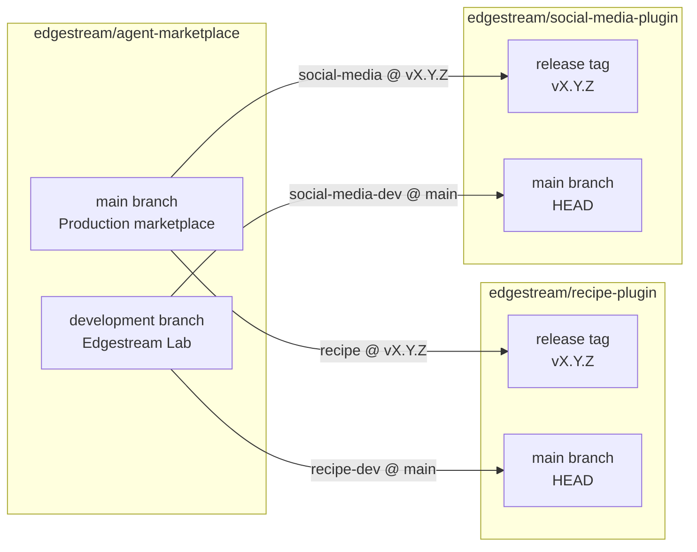

# Edgestream Marketplace

This repository follows the [Agent Plugins specification](https://agent-plugins.org/).

## Reference strategy

The `development` branch is the mutable **Edgestream Lab** catalog. Its `*-dev`
entries follow the plugin repositories' `main` branch at HEAD so changes can be
tested immediately. The `main` branch is the stable production catalog: released
entries point to immutable, named version tags instead of a moving branch.

Promotion to production therefore means creating a version tag in the plugin
repository and updating the production manifest to that exact tag. Lab remains
on HEAD and receives subsequent development changes without a marketplace
version bump.
